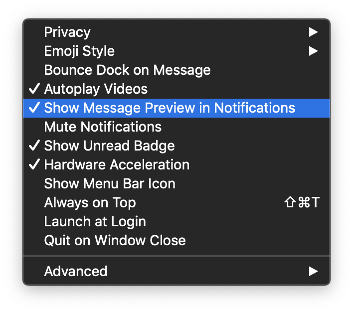
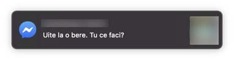
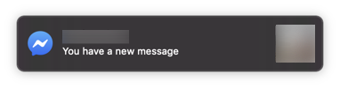
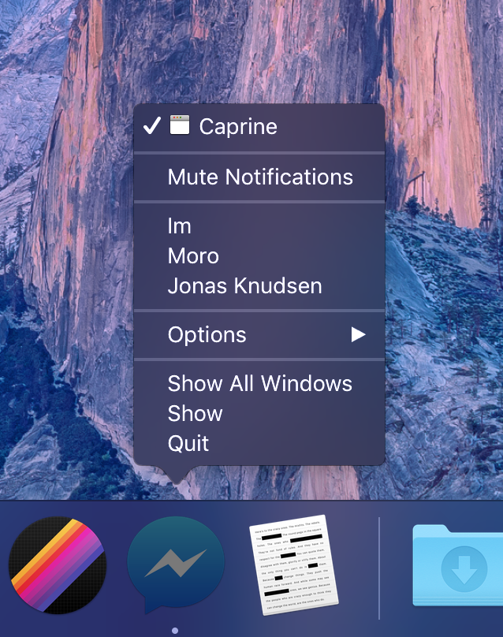
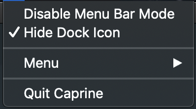

<div align="center">
	<br>
	<br>
	<a href="https://sindresorhus.com/caprine">
		
	</a>
	<h1>Caprine</h1>
	<p>
		<b>Elegant Facebook Messenger desktop app</b>
	</p>
	<br>
	<br>
	<p>
		Caprine is an unofficial and privacy-focused Facebook Messenger app with many useful features.
	</p>
	<b>
		Caprine is feature complete. However, we welcome contributions for improvements and bug fixes.
	</b>
	<br>
		<a href="https://sindresorhus.com/caprine">
		Website
		</a>
	<br>
	<a href="https://github.com/sindresorhus/caprine/releases/latest">
		
	</a>
</div>

## Highlights

- [Dark theme](#dark-mode)
- [Vibrant theme](#vibrancy-macos-only)\*
- [Privacy-focused](#privacy)
- [Keyboard shortcuts](#keyboard-shortcuts)
- [Menu bar mode](#menu-bar-mode-macos-only-)\*
- [Work Chat support](#work-chat-support)
- [Code blocks](#code-blocks)
- [Touch Bar support](#touch-bar-support-macos-only)\*
- [Custom styles](#custom-styles)
- Cross-platform
- Silent auto-updates
- Custom text size
- Emoji style setting
- Respects Do Not Disturb\*

\*macOS only

## Install

*macOS 10.10+, Linux, and Windows 7+ are supported (64-bit only).*

Download the latest version on the [website](https://sindresorhus.com/caprine) or below.

### macOS

[**Download**](https://github.com/sindresorhus/caprine/releases/latest) the `.dmg` file.

Or with [Homebrew](https://brew.sh): `$ brew install caprine`

### Linux

<table>
	<th>Distribution</th>
	<th>Repository</th>
	<th>Automatic Updates</th>
	<th>Maintainer</th>
	<th>How to install</th>
	<tr>
		<td>Arch Linux</td>
		<td>Community</td>
		<td align="center">✔️</td>
		<td>Frederik Schwan</td>
		<td><code>pacman -S caprine</code></td>
	</tr>
	<tr>
		<td>Debian / Ubuntu (manually)</td>
		<td>GitHub</td>
		<td align="center">❌</td>
		<td>Official</td>
		<td>
			<a href="https://github.com/sindresorhus/caprine/releases/latest">Download</a> the .deb file
		</td>
	</tr>
	<tr>
		<td>Debian / Ubuntu (deb-get)</td>
		<td>GitHub</td>
		<td align="center">✔️</td>
		<td>Official</td>
		<td>
			Follow the <a href=#installation-using-deb-get>instructions below</a>
		</td>
	</tr>
	<tr>
		<td>Debian / Ubuntu (APT)</td>
		<td>Gemfury</td>
		<td align="center">✔️</td>
		<td>Lefteris Garyfalakis</td>
		<td>
			Follow the <a href=#apt-repository-gemfury>instructions below</a>
		</td>
	</tr>
	<tr>
		<td>RHEL / Fedora / openSUSE</td>
		<td>Copr</td>
		<td align="center">✔️</td>
		<td>Dušan Simić</td>
		<td>
			Follow the <a href=#copr>instructions below</a>
		</td>
	</tr>
	<tr>
		<td>AppImage</td>
		<td>GitHub</td>
		<td align="center">✔️</td>
		<td>Official</td>
		<td>
			Follow the <a href=#appimage>instructions below</a>
		</td>
	</tr>
	<tr>
		<td>Flatpak</td>
		<td>Flathub</td>
		<td align="center">✔️</td>
		<td>Dušan Simić</td>
		<td>
			Visit <a href="https://flathub.org/apps/details/com.sindresorhus.Caprine">Flathub</a> and follow the instructions
		</td>
	</tr>
	<tr>
		<td>Snap</td>
		<td>Snapcraft</td>
		<td align="center">✔️</td>
		<td>Official</td>
		<td>
			Visit <a href="https://snapcraft.io/caprine">Snapcraft</a> and follow the instructions
		</td>
	</tr>
</table>

#### Installation using deb-get:

* Download and install [deb-get](https://github.com/wimpysworld/deb-get).
* Run `deb-get install caprine`.

Note: deb-get is 3rd party software, not to be associated with apt-get.

#### APT repository (Gemfury):

Run the following command to add it:

```sh
wget -q -O- https://raw.githubusercontent.com/sindresorhus/caprine/main/packages/deb/addRepo.sh | sudo bash
```

Alternatively (for advanced users):
```sh
# Add the repository
echo "deb [trusted=yes] https://apt.fury.io/lefterisgar/ * *" > \
/etc/apt/sources.list.d/caprine.list

# Update the package indexes
sudo apt update

# Install Caprine
sudo apt install caprine
```


#### Copr:

For Fedora / RHEL:

```sh
sudo dnf copr enable dusansimic/caprine
sudo dnf install caprine
```

For openSUSE:
- Create a new file in `/etc/zypp/repos.d/caprine.repo`.
- Copy the contents of [this file](https://copr.fedorainfracloud.org/coprs/dusansimic/caprine/repo/opensuse-tumbleweed/dusansimic-caprine-opensuse-tumbleweed.repo) and paste them into the file you just created.

Alternatively use the following one-liner:
```sh
curl -s https://copr.fedorainfracloud.org/coprs/dusansimic/caprine/repo/opensuse-tumbleweed/dusansimic-caprine-opensuse-tumbleweed.repo | sudo tee /etc/zypp/repos.d/caprine.repo
```

#### AppImage:

[Download](https://github.com/sindresorhus/caprine/releases/latest) the `.AppImage` file.

Make it [executable](https://discourse.appimage.org/t/how-to-run-an-appimage/80):

```sh
chmod +x Caprine-2.xx.x.AppImage
```

Then run it!

#### About immutable Linux distributions:
[Fedora Silverblue](https://silverblue.fedoraproject.org), [Fedora Kinoite](https://kinoite.fedoraproject.org), [EndlessOS](https://endlessos.com), [CarbonOS](https://carbon.sh) and other immutable distributions only support Flatpak and/or AppImage.*

*Note: On some distributions Flatpak must be [pre-configured manually](https://flatpak.org/setup).*

### Windows

<table>
	<th>Method</th>
	<th>Repository</th>
	<th>Automatic Updates</th>
	<th>Maintainer</th>
	<th>How to install</th>
	<tr>
		<td>Manually</td>
		<td>GitHub</td>
		<td align="center">❌</td>
		<td>Official</td>
		<td>
			<a href="https://github.com/sindresorhus/caprine/releases/latest">Download</a> the .exe file
		</td>
	</tr>
	<tr>
		<td>Chocolatey</td>
		<td>Community</td>
		<td align="center">✔️</td>
		<td>Michael Quevillon</td>
		<td><code>choco install caprine</code></td>
	</tr>
</table>

*For taskbar notification badges to work on Windows 10, you'll need to [enable them in Taskbar Settings](https://www.tenforums.com/tutorials/48186-taskbar-buttons-hide-show-badges-windows-10-a.html).*

## Features

### Dark mode

You can toggle dark mode in the `View` menu or with <kbd>Command</kbd> <kbd>d</kbd> / <kbd>Control</kbd> <kbd>d</kbd>.


### Hide Names and Avatars

You can prevent others from looking at who you're chatting with by enabling the “Hide Names and Avatars” feature in the “View” menu or with <kbd>Command/Control</kbd> <kbd>Shift</kbd> <kbd>n</kbd>.

### Vibrancy *(macOS only)*

On *macOS*, you can toggle the window vibrancy effect in the `View` menu.


### Privacy


You can choose to prevent people from knowing when you have seen a message and when you are currently typing. These settings are available under the `Caprine`/`File` menu.

### Mute desktop notifications *(macOS only)*

You can quickly disable receiving notifications from the `Caprine`/`File` menu or the Dock on macOS.

### Hide notification message preview

<div align="center"></div>

<div align="center"></div>

<div align="center"></div>

You can toggle the `Show Message Preview in Notification` setting in the `Caprine`/`File` menu.

### Prevents link tracking

Links that you click on will not be tracked by Facebook.

### Jump to conversation hotkey

You can switch conversations similar to how you switch browser tabs: <kbd>Command/Control</kbd> <kbd>n</kbd> (where `n` is `1` through `9`).

### Compact mode

The interface adapts when resized to a small size.

<div align="center"></div>

### Desktop notifications

Desktop notifications can be turned on in `Preferences`.

<div align="center"></div>

### Always on Top

You can toggle whether Caprine stays on top of other windows in the `Window`/`View` menu or with <kbd>Command/Control</kbd> <kbd>Shift</kbd> <kbd>t</kbd>.

### Work Chat support

Support for Work Chat: Messenger for [Workplace](https://www.facebook.com/workplace). You can switch to it in the `Caprine`/`File` menu.

<div align="center"></div>

### Code blocks

You can send code blocks by using [Markdown syntax](https://github.com/adam-p/markdown-here/wiki/Markdown-Cheatsheet#code).

<div align="center"></div>
<div align="center"></div>

### Background behavior

When closing the window, the app will by default continue running in the background, in the dock on macOS and the tray on Linux/Windows. Right-click the dock/tray icon and choose `Quit` to completely quit the app. On macOS, click the dock icon to show the window. On Linux, right-click the tray icon and choose `Toggle` to toggle the window. On Windows, click the tray icon to toggle the window.

Note that you can change the behavior of Caprine so that the app closes when the window is closed. For this, you'll need to go to the settings and click on `Quit on Window Close`.

### Quick access to conversations from the Dock menu *(macOS only)*



### Touch Bar support *(macOS only)*


### Custom languages for spell-check *(Not for macOS)*

Users can select supported languages from `Conversation` → `Spell Checker Language`.

macOS detects the language automatically.

### Custom styles

Advanced users can modify the colors/styles of Caprine. Click the menu item `Caprine`/`File` → `Caprine Settings` → `Advanced` → `Custom Styles` and a CSS file will open up in your default editor.

### Menu Bar Mode *(macOS only)* 



You can enable `Show Menu Bar Icon` in the `Caprine Preferences` menu to have a Caprine icon in the menu bar. The icon will indicate when you have unread notifications and you can click it to toggle the Caprine window. You can also toggle the Caprine window with the global shortcut <kbd>Command</kbd> <kbd>Shift</kbd> <kbd>y</kbd>.

You can also remove Caprine from the Dock and task switcher by clicking `Hide Dock Icon` menu item from the menu bar icon. There will then no longer be any menus for the window, but you can access those from the `Menu` item in the menu bar icon menu.

### Keyboard shortcuts

Description            | Keys
-----------------------| -----------------------
New conversation       | <kbd>Command/Control</kbd> <kbd>n</kbd>
Search conversations   | <kbd>Command/Control</kbd> <kbd>k</kbd>
Toggle "Dark mode"     | <kbd>Command/Control</kbd> <kbd>d</kbd>
Hide Names and Avatars | <kbd>Command/Control</kbd> <kbd>Shift</kbd> <kbd>n</kbd>
Next conversation      | <kbd>Command/Control</kbd> <kbd>]</kbd> or <kbd>Control</kbd> <kbd>Tab</kbd>
Previous conversation  | <kbd>Command/Control</kbd> <kbd>[</kbd> or <kbd>Control</kbd> <kbd>Shift</kbd> <kbd>Tab</kbd>
Jump to conversation   | <kbd>Command/Control</kbd> <kbd>1</kbd>…<kbd>9</kbd>
Insert GIF             | <kbd>Command/Control</kbd> <kbd>g</kbd>
Insert sticker         | <kbd>Command/Control</kbd> <kbd>s</kbd>
Insert emoji           | <kbd>Command/Control</kbd> <kbd>e</kbd>
Attach files           | <kbd>Command/Control</kbd> <kbd>t</kbd>
Focus text input       | <kbd>Command/Control</kbd> <kbd>i</kbd>
Search in conversation | <kbd>Command/Control</kbd> <kbd>f</kbd>
Mute conversation      | <kbd>Command/Control</kbd> <kbd>Shift</kbd> <kbd>m</kbd>
Hide conversation      | <kbd>Command/Control</kbd> <kbd>Shift</kbd> <kbd>h</kbd>
Delete conversation    | <kbd>Command/Control</kbd> <kbd>Shift</kbd> <kbd>d</kbd>
Toggle "Always on Top" | <kbd>Command/Control</kbd> <kbd>Shift</kbd> <kbd>t</kbd>
Toggle window menu     | <kbd>Alt</kbd> *(Windows/Linux only)*
Toggle main window     | <kbd>Command</kbd> <kbd>Shift</kbd> <kbd>y</kbd> *(macOS only)*
Toggle sidebar         | <kbd>Command/Control</kbd> <kbd>Shift</kbd> <kbd>s</kbd>
Switch to Messenger    | <kbd>Command/Control</kbd> <kbd>Shift</kbd> <kbd>1</kbd>
Switch to Workchat     | <kbd>Command/Control</kbd> <kbd>Shift</kbd> <kbd>2</kbd>
Preferences            | <kbd>Command/Control</kbd> <kbd>,</kbd>

###### Tip

On macOS, you can [change these in the System Preferences](https://www.intego.com/mac-security-blog/how-to-make-custom-keyboard-shortcuts-for-any-macos-menu-items-and-to-launch-your-favorite-apps/) and you can even add your own keyboard shortcuts for menu items without a predefined keyboard shortcut.

## FAQ

#### Can I contribute localizations?

The main app interface is already localized by Facebook. The app menus are not localized, and we're not interested in localizing those.

---

## Dev

Built with [Electron](https://electronjs.org).

### Run

```sh
npm install && npm start
```

### Build

See the [`electron-builder` docs](https://www.electron.build/multi-platform-build).

### Publish

```sh
npm run release
```

Then edit the automatically created GitHub Releases draft and publish.

## Maintainers

- [Dušan Simić](https://github.com/dusansimic)
- [Lefteris Garyfalakis](https://github.com/lefterisgar)
- [Michael Quevillon](https://github.com/mquevill)
- [Nikolas Spiridakis](https://github.com/1nikolas)

**Former**

- [Jarek Radosz](https://github.com/CvX)

## Links

- [Product Hunt post](https://www.producthunt.com/posts/caprine-2)

## Press

- [The Essential Windows Apps for 2018 - Lifehacker](https://lifehacker.com/lifehacker-pack-for-windows-our-list-of-the-essential-1828117805)
- [Caprine review: Customize Facebook Messenger on Windows 10 - Windows Central](https://www.windowscentral.com/caprine-review-customizing-facebook-messenger-windows-10)

## Disclaimer

Caprine is a third-party app and is not affiliated with Facebook.
