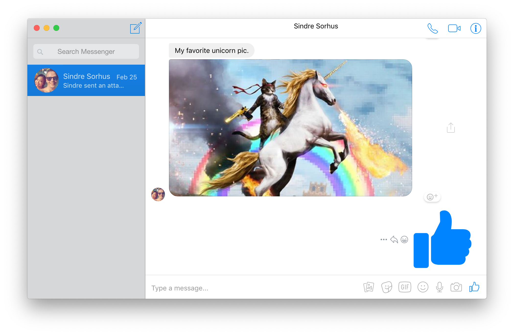
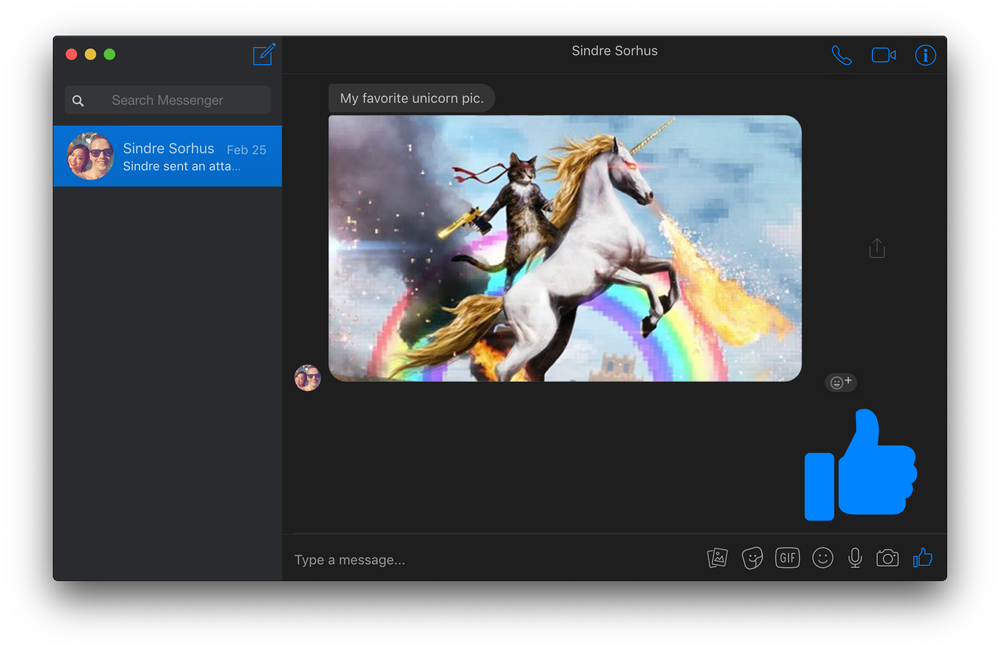
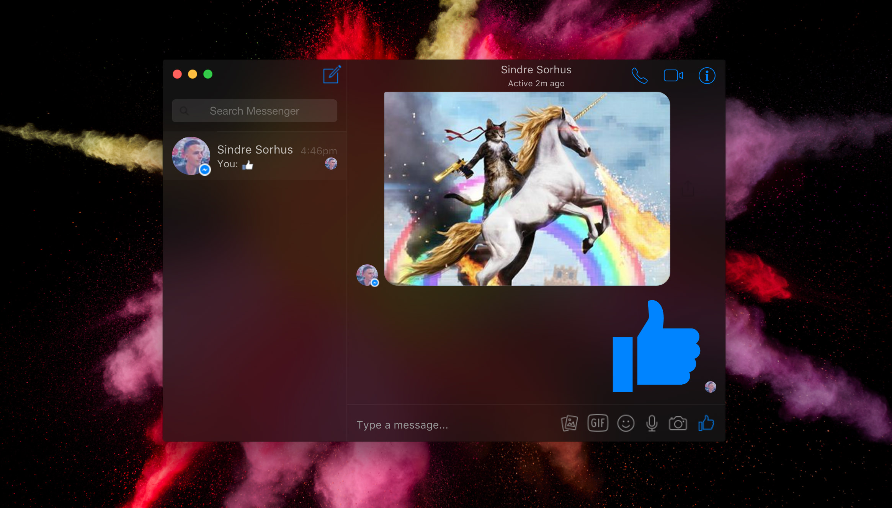
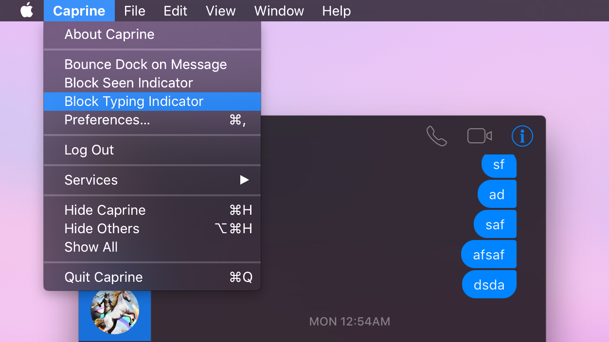
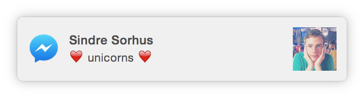
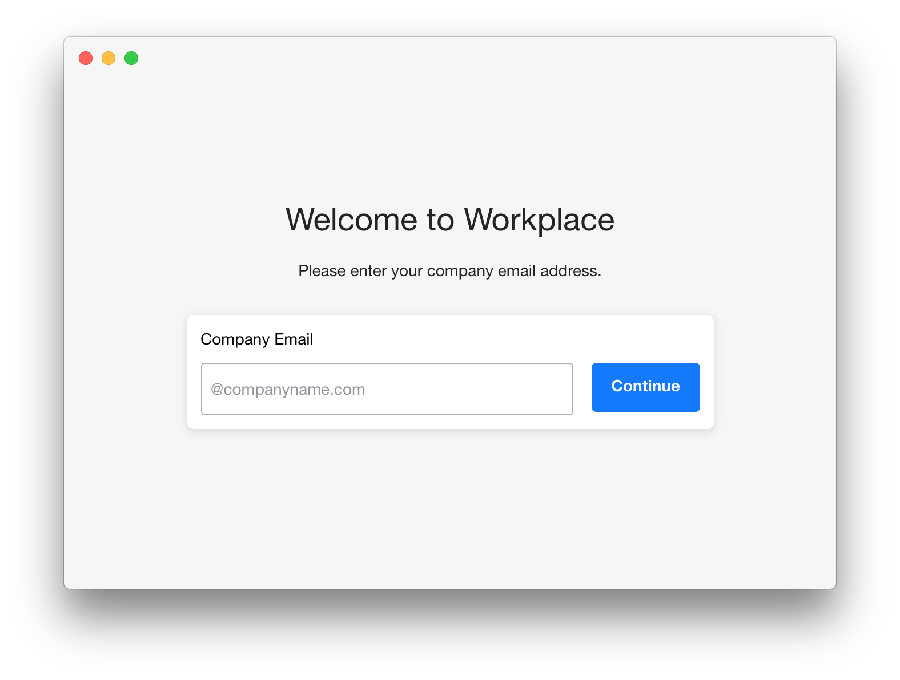
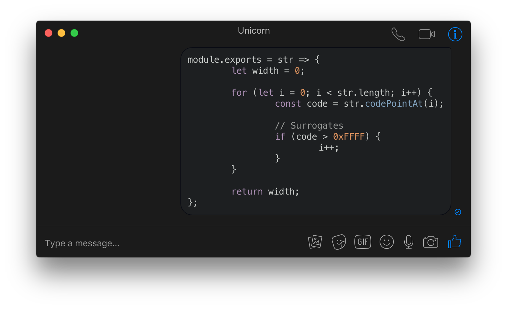
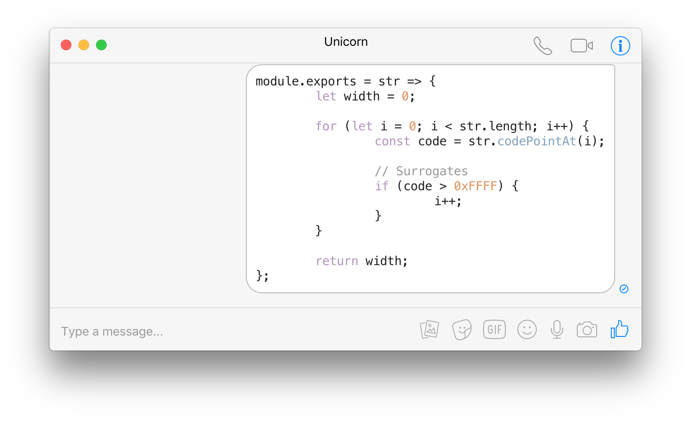

# Caprine 

> Elegant Facebook Messenger desktop app

Caprine is an unofficial and privacy focused Facebook Messenger app with many useful features.

**[Website](https://sindresorhus.com/caprine)** &nbsp;&nbsp; **[Discuss it on Product Hunt](https://www.producthunt.com/posts/caprine-2)**

<br>

<a href="https://github.com/sindresorhus/caprine/releases/latest">
	
</a>


## Highlights

- [Dark theme](#dark-mode)
- [Vibrant theme](#vibrancy)*
- [Privacy focused](#hide-last-seen--typing-indicator)
- [Keyboard shortcuts](#keyboard-shortcuts)
- [Work Chat support](#work-chat-support)
- [Code blocks](#code-blocks)
- Cross-platform
- Silent auto-updates
- Custom text size

\*macOS only

## Install

*macOS 10.9+, Linux, and Windows 7+ are supported (64-bit only).*

Download the latest version on the [website](https://sindresorhus.com/caprine) or below.

### macOS

[**Download**](https://github.com/sindresorhus/caprine/releases/latest) the `.dmg` file.

Or with [Homebrew-Cask](https://caskroom.github.io): `$ brew cask install caprine`

### Linux

[**Download**](https://github.com/sindresorhus/caprine/releases/latest) the `.AppImage` or `.deb` file.

*The AppImage needs to be [made executable](http://discourse.appimage.org/t/how-to-make-an-appimage-executable/80) after download.*

### Windows

[**Download**](https://github.com/sindresorhus/caprine/releases/latest) the `.exe` file.

*For taskbar notification badges to work on Windows 10, you'll need to [enable it in Taskbar Settings](https://www.tenforums.com/tutorials/48186-taskbar-buttons-hide-show-badges-windows-10-a.html).*


## Features

### Dark mode

You can toggle dark mode in the `View` menu or with <kbd>Cmd</kbd> <kbd>D</kbd> / <kbd>Ctrl</kbd> <kbd>D</kbd>.



### Vibrancy

On *macOS*, you can toggle the window vibrancy effect in the `View` menu.



### Hide last seen / typing indicator



You can choose to prevent people from knowing when you've seen a message or are currently typing. Both options are available under the `Caprine`/`File` menu.

### Mute desktop notifications

You can quickly disable receiving notifications from the `Caprine`/`File` menu or the Dock on macOS.

### Prevents link tracking

Links that you click on will not be tracked by Facebook.

### Jump to conversation hotkey

You can switch conversations similar to how you switch browser tabs: <kbd>Cmd/Ctrl</kbd> <kbd>n</kbd> (where `n` is `1` through `9`).

### Compact mode

The interface adapts when resized to a small size.

<div align="center"></div>

### Desktop notifications

Desktop notifications can be turned on in Preferences.

<div align="center"></div>

### Always on Top

You can toggle whether Caprine stays on top of other windows in the `Window`/`View` menu or with <kbd>Cmd/Ctrl</kbd> <kbd>Shift</kbd> <kbd>t</kbd>.

### Image paste confirmation

Confirmation before sending images from the clipboard, to prevent accidental copy-pastes.

### Work Chat support

Support for Work Chat: Messenger for [Workplace](https://www.facebook.com/workplace). You can switch to it in the `Caprine`/`File` menu.

<div align="center"></div>

### Code blocks

You can send code blocks by using [Markdown syntax](https://github.com/adam-p/markdown-here/wiki/Markdown-Cheatsheet#code).

<div align="center"></div>
<div align="center"></div>

### Background behavior

When closing the window, the app will continue running in the background, in the dock on macOS and the tray on Linux/Windows. Right-click the dock/tray icon and choose `Quit` to completely quit the app. On macOS, click the dock icon to show the window. On Linux, right-click the tray icon and choose `Toggle` to toggle the window. On Windows, click the tray icon to toggle the window.

### Keyboard shortcuts

Description            | Keys
-----------------------| -----------------------
New conversation       | <kbd>Cmd/Ctrl</kbd> <kbd>n</kbd>
Search conversations   | <kbd>Cmd/Ctrl</kbd> <kbd>f</kbd>
Toggle "Dark mode"     | <kbd>Cmd/Ctrl</kbd> <kbd>d</kbd>
Next conversation      | <kbd>Cmd/Ctrl</kbd> <kbd>]</kbd> or <kbd>Ctrl</kbd> <kbd>Tab</kbd>
Previous conversation  | <kbd>Cmd/Ctrl</kbd> <kbd>[</kbd> or <kbd>Ctrl</kbd> <kbd>Shift</kbd> <kbd>Tab</kbd>
Jump to conversation   | <kbd>Cmd/Ctrl</kbd> <kbd>1</kbd>…<kbd>9</kbd>
Insert GIF             | <kbd>Cmd/Ctrl</kbd> <kbd>g</kbd>
Insert emoji           | <kbd>Cmd/Ctrl</kbd> <kbd>e</kbd>
Mute conversation      | <kbd>Cmd/Ctrl</kbd> <kbd>Shift</kbd> <kbd>m</kbd>
Archive conversation   | <kbd>Cmd/Ctrl</kbd> <kbd>Shift</kbd> <kbd>a</kbd>
Delete conversation    | <kbd>Cmd/Ctrl</kbd> <kbd>Shift</kbd> <kbd>d</kbd>
Toggle "Always on Top" | <kbd>Cmd/Ctrl</kbd> <kbd>Shift</kbd> <kbd>t</kbd>
Toggle window menu     | <kbd>Alt</kbd> *(Windows only)*
Toggle sidebar         | <kbd>Cmd/Ctrl</kbd> <kbd>Shift</kbd> <kbd>s</kbd>
Preferences            | <kbd>Cmd/Ctrl</kbd> <kbd>,</kbd>


---


## Dev

Built with [Electron](https://electronjs.org).

### Run

```
$ npm install && npm start
```

### Build

See the [`electron-builder` docs](https://github.com/electron-userland/electron-builder/wiki/Multi-Platform-Build).

### Publish

Use [`np`](https://github.com/sindresorhus/np) and for example run:

```
$ np minor --no-publish
```

Then edit the automatically created GitHub Releases draft, remove the `.pkg` file, and publish.


## Maintainers

- [Sindre Sorhus](https://sindresorhus.com)
- [Aw Young Qingzhuo](https://github.com/veniversum)


## Disclaimer

Caprine is a third-party app and is not affiliated with Facebook.


## License

MIT
