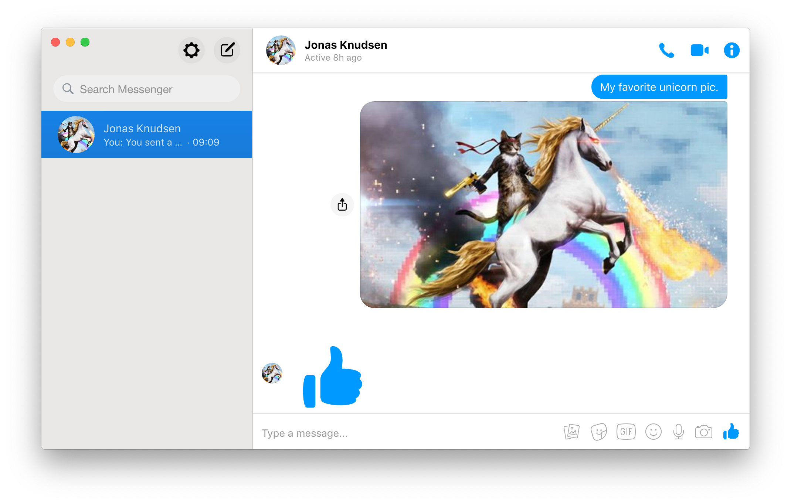

# &nbsp;Caprine

> Unofficial Facebook Messenger app

<br>
[](https://github.com/sindresorhus/caprine/releases/latest)

*Requires OS X 10.8 or newer and Linux. Windows support planned.*

## Installing on OS X

*To run on Linux, clone the source and follow the ``dev`` instructions below.*

### [Homebrew Cask](http://caskroom.io)

```
$ brew cask install caprine
```

### Manually

[**Download**](https://github.com/sindresorhus/caprine/releases/latest), unzip, and move `Caprine.app` to the `/Applications` directory.


## Compact mode

The interface adapts when resized to a small size.

<div align="center"></div>


## Desktop notifications

Desktop notifications can be turned on in Preferences.

<div align="center"></div>

NOTE: There is a [known bug](https://github.com/atom/electron/issues/2294) with Electron's handling of desktop notifications on systems running Gnome 3 that may cause Caprine to crash if notifications are clicked. Until this bug is resolved, do not click on notifications if they cause your the app to crash on your system.

## Dev

Built with [Electron](http://electron.atom.io).

###### Commands

- Init: `$ npm install`
- Run: `$ npm start`
- Build: `$ npm run build`


## License

MIT © [Sindre Sorhus](http://sindresorhus.com)
